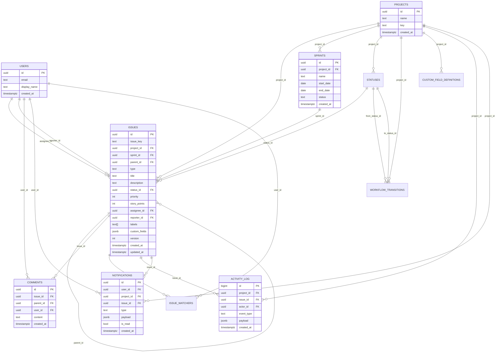

# Design Documentation

This document covers:
- Architecture decisions and rationale
- Database schema diagram (ERD)
- Trade-offs and optimization choices

## 1) Architecture Decisions

## 1.1 Chosen architecture: Modular Monolith

### What was chosen
A modular monolith in Go, with domain-driven packages:
- `issues`
- `sprints`
- `projects`
- `search`
- `notifications`
- `realtime`

### Why this design
- **Delivery speed**: simpler than microservices for a 12-15 hour assignment scope.
- **Lower operational complexity**: single deployable unit, no inter-service networking or distributed tracing required.
- **Maintainability**: clear module boundaries make future extraction possible if needed.
- **Data consistency**: transactional operations across related entities are straightforward in one service.

### Why not microservices now
- Higher infra complexity (service discovery, retries, circuit breaking, distributed transactions)
- More deployment overhead and cognitive load
- Little benefit for current scope/traffic profile

## 1.2 PostgreSQL as source of truth

### What was chosen
PostgreSQL stores all durable domain data.

### Why this design
- **Relational integrity** is central (projects, issues, sprints, statuses, transitions, comments, activity).
- **Strong constraints** enforce data quality (issue types, status categories, FK relationships).
- **Transactional safety** for multi-step operations (issue updates, transitions, sprint completion).
- **Search support** via full-text indexing and SQL filtering.

### Why not NoSQL-first
- The assignment domain is relationship-heavy and workflow-constrained.
- SQL model maps naturally to joins and integrity constraints.

## 1.3 Redis + WebSocket for realtime collaboration

### What was chosen
- WebSocket for client push
- Redis for pub/sub fan-out and replay buffer

### Why this design
- **Low latency updates** for board/issue changes
- **Cross-instance event fan-out** (if horizontally scaled)
- **Reconnect support** via replay (`since` event id)
- **Reduced DB polling pressure**

### Why not polling-only
- Higher latency UX
- Increased query load on database
- Worse user experience under active collaboration

## 1.4 Concurrency model: Optimistic Locking

### What was chosen
Issue updates use `version` checks (`WHERE id = ? AND version = ?`).

### Why this design
- Prevents silent overwrites when two users edit same issue
- Returns explicit `409 conflict`, enabling safe client retry flow
- Avoids heavy pessimistic row locking

### Why not last-write-wins
- Can lose user changes without visibility

## 1.5 Pagination model: Cursor-based

### What was chosen
Cursor-based pagination for activity and search endpoints.

### Why this design
- Stable under frequent inserts/updates
- Better for streams and large datasets than offset pagination

### Why not offset-only
- Page drift can cause duplicates/skips while data changes

---

## 2) Database Schema (ERD)

---

## 3) Trade-offs and Optimization Rationale

## 3.1 What was optimized for
- **Correctness and consistency** in workflow/state transitions
- **Realtime collaboration UX** (fast updates + replay)
- **Developer productivity** (clear structure, quick iteration)
- **Operational simplicity** for assignment-scale deployment

## 3.2 Trade-offs accepted
- **Auth/RBAC depth limited** in current scope
  - APIs are functional for collaboration flows but not full enterprise permission model
- **Presence granularity**
  - presence is project/board-level, not issue-level page tracking
- **Replay buffer bounded in Redis**
  - recent-event replay supported, not infinite history replay
- **Single-service scaling**
  - easier to run now, but not independently scalable per domain yet

## 3.3 Why these trade-offs are reasonable
- They prioritize assignment goals: workflow engine, collaboration APIs, realtime sync, and robust data model.
- They keep architecture production-aligned while avoiding over-engineering.
- The current structure leaves clear extension points for enterprise features later.

## 4) Future Improvements (if more time)
- Add authentication and role-based authorization (RBAC)
- Add issue-level presence tracking
- Add richer transition automation hooks (reviewer assignment strategies, rule plugins)
- Add load/perf test suite with concrete throughput metrics
- Add metrics/tracing dashboards and SLO alerts
- Add dedicated `GET /api/issues/:id` detailed view endpoint
